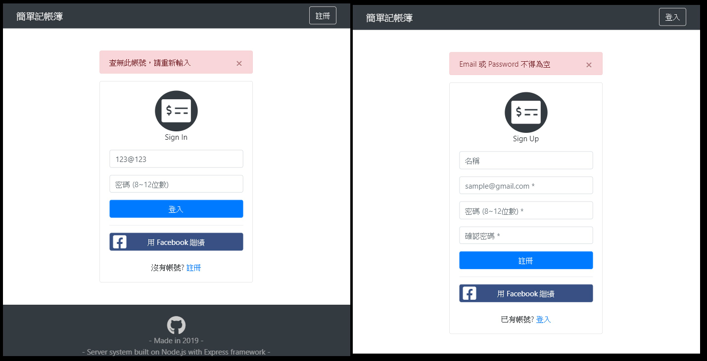
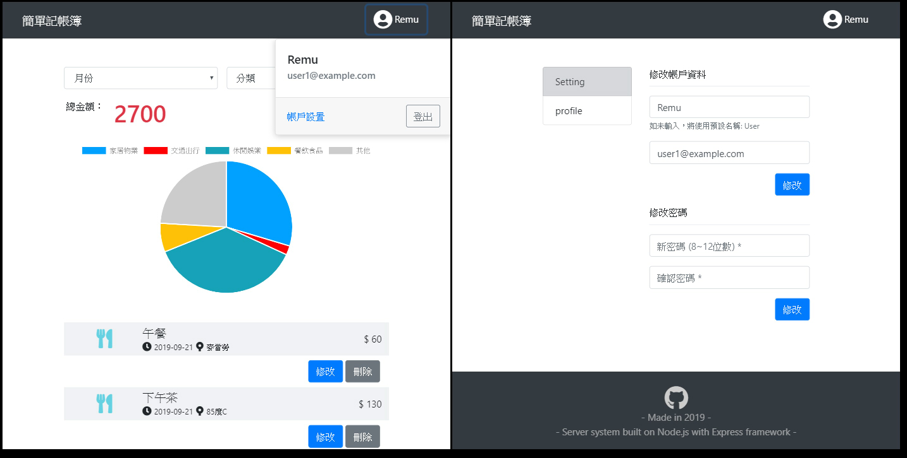

# Expense Tracker 簡單記帳簿
A expense tracker app. <br>
This is a student project that built on Node.js with Express framework. <br>
Database used mongoDB.

簡易的記帳 App。 <br>
這是一個用 Node.js 架設網站的練習專案。

目前使用 branch 保存不同版本，數字越大者越新。

| 單元 | branch   |
| ----| -------- |
| A16 | master   |
| A17 | ac_a17   |

#### 練習目標
* 沿用至今前後端所學，打造一個 Web App
* Node.js + Express 建立 App
* 透過 mongoose 操作 mongoDB 資料庫
* 實作使用者認證系統
* 透過 PaaS 雲端服務佈署 App

## Preview Pages



#### 功能
A16
* 使用者認證系統，可註冊/登入/登出
* 可透過 Facebook 進行登入 (localhost限定)
* 可以建立/編輯/刪除支出紀錄
* 於首頁能瀏覽所有支出紀錄
* 可依分類篩選不同支出紀錄
* 依頁面上的所有支出紀錄，自動計算總金額
* RWD 自適應
* 前後端皆檢查 user input

A17
* 新增店家欄位
* 新增依月份篩選功能
* 新增編輯 User setting 功能
* 新增圓餅圖分析數據功能

## Usage
* 可前往 [Heroku](https://lastor-expense-tracker-a17.herokuapp.com) 瀏覽佈署版本。 (無法使用 Facebook 登入)
* 或在本機端執行 (需下載，並安裝依賴套件)

安裝方法，請參考下方 [Dependency packages](#Dependency-packages) 與 [Installation](#Installation) 項目。 <br>
安裝完成後，使用以下步驟於本機端啟動專案。

1. 於 mongoDB 安裝目錄，啟動 mongoDB。 
    
    * macOS [官方文件](https://docs.mongodb.com/manual/tutorial/install-mongodb-enterprise-on-os-x/#run-mongodb)
    ```
    $ ~/mongodb/bin> mongod --dbpath <path to data directory>
    ```
    
    * windows(需用系統管理員執行) [官方文件](https://docs.mongodb.com/manual/tutorial/install-mongodb-enterprise-on-windows/#start-mdb-edition-as-a-windows-service)
    ```
    $ net start mongodb
    ```

1. 回到專案目錄，執行 seeder，用於 mongoDB 建立基本資料 (非必須)
    ```
    $ npm run seeder
    ```

    * 執行 seed 後可使用假帳戶進行快速測試
    ```
    // file path: /models/seeds/users.json
    
    email: "user1@example.com",
    password: "12345678"
    
    email: "user2@example.com",
    password: "12345678"
    ```
    
    * 如有需要，可使用 remover 快速清空資料庫
    ```
    $ npm run remover
    ```


1. 於專案根目錄中新建 .env 檔案，設置環境變數。(Facebook 開發者 App 資訊)
    ```
    FACEBOOK_ID = ***
    FACEBOOK_SECRET = ***
    FACEBOOK_CALLBACK = http://localhost:3000/auth/facebook/callback
    ```

1. 啟動 Node.js Server
    
    * 有安裝 nodemon，於專案根目錄執行
    ```
    $ npm run dev
    ```

    * 未安裝 nodemon，於專案根目錄執行
    ```
    $ npm run start
    ```

1. 於瀏覽器開啟網頁
    ```
    http://localhost:3000
    ```

1. 瀏覽完畢後，關閉 Node.js Server
    ```
    回到 cmd 按下 Ctrl + C
    ```

1. 關閉 mongoDB
    * macOS
    ```
    關閉 Terminal 即可
    ```
    
    * windows(需用系統管理員執行)
    ```
    $ net stop mongodb
    ```

## Dependency packages
#### main
* [Node.js](https://nodejs.org/en/) v10.16.3
* [mongoDB](https://www.mongodb.com/) v4.0.12

#### npm package
```
"devDependencies": {
  "nodemon": "^1.19.2",
  "dotenv": "^8.1.0"
},
"dependencies": {
  "bcryptjs": "^2.4.3",
  "connect-flash": "^0.1.1",
  "express": "^4.17.1",
  "express-handlebars": "^3.1.0",
  "express-session": "^1.16.2",
  "method-override": "^3.0.0",
  "mongoose": "^5.6.12",
  "passport": "^0.4.0",
  "passport-facebook": "^3.0.0",
  "passport-local": "^1.0.0"
}
```

#### front-end package (imported from CDN)
* [Bootstrap](https://getbootstrap.com/) v4.3.1
  * jQuery v3.4.1
  * popper v1.14.7
* [Font-Awesome](https://fontawesome.com/) v5.10.2
* [Chart.js](https://www.chartjs.org/) v2.8.0


## Installation
於本機端執行前，請確認是否已安裝下列內容。

#### Download Project
1. 直接於 Github 上用瀏覽器下載 ZIP file
2. 用 Git clone 專案 (推薦)
```
$ git clone https://github.com/Lastor-Chen/expense-tracker.git [資料夾名稱]
```

#### Install Node.js
本機端必須安裝 Node.js 與相關 package 才能執行此專案。 <br>
如尚未安裝 Node.js，建議使用 nvm toolkit 下載指定版本的 Node.js

| OS | URL |
| -------- | -------- |
| nvm-windows     | [Link to](https://github.com/coreybutler/nvm-windows) |
| nvm-macOS     | [Link to](https://github.com/nvm-sh/nvm) |

#### Install dependency npm packages
已在 package.json 中登入相關訊息，可直接執行下列指令安裝所需套件。
```
$ npm install
```

#### Download mongoDB
本機端必須安裝 mongoDB 才能執行此專案。 <br>
請連結到 mongoDB 官方網站[下載](https://www.mongodb.com/download-center/community)。

※ 注意，Windows 用戶可能會於安裝 GUI Compass 時出問題。建議安裝時不勾選，另行安裝 [Robo 3T](https://robomongo.org/)。

#### 選擇安裝 nodemon
本專案推薦使用 [nodemon](https://github.com/remy/nodemon) 來取代原生的 Node.js 啟動方法。
```
$ npm install -g nodemon
```